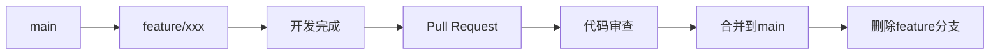

# Git 使用指南 - 个人知识库系统

## 目录
1. [Git基础概念](#git基础概念)
2. [日常开发工作流](#日常开发工作流)
3. [分支管理策略](#分支管理策略)
4. [代码提交规范](#代码提交规范)
5. [常见操作指南](#常见操作指南)
6. [问题解决](#问题解决)
7. [最佳实践](#最佳实践)

## Git基础概念

### 什么是Git？
Git是一个分布式版本控制系统，用于跟踪文件的变化。对于个人知识库系统，Git可以帮助你：

- 保存代码的历史版本
- 协作开发（如果需要）
- 回滚到之前的版本
- 管理不同的功能分支

### 核心概念

| 概念 | 说明 | 示例 |
|------|------|------|
| **仓库 (Repository)** | 项目代码的存储位置 | `personal-knowledge-base/` |
| **提交 (Commit)** | 代码变更的快照 | `git commit -m "添加搜索功能"` |
| **分支 (Branch)** | 独立的开发线 | `feature/search` |
| **合并 (Merge)** | 合并分支的更改 | `git merge feature/search` |
| **远程仓库 (Remote)** | 云端代码仓库 | `origin` (GitHub) |
| **拉取 (Pull)** | 获取远程更新 | `git pull origin main` |
| **推送 (Push)** | 上传本地更改 | `git push origin main` |

## 日常开发工作流

### 标准工作流程

```bash
# 1. 获取最新代码
git pull origin main

# 2. 创建功能分支
git checkout -b feature/your-feature-name

# 3. 进行开发修改
# ... 编辑文件 ...

# 4. 查看更改状态
git status

# 5. 添加更改到暂存区
git add .

# 6. 提交更改
git commit -m "feat: 添加新功能描述"

# 7. 推送到远程
git push origin feature/your-feature-name

# 8. 创建Pull Request（在GitHub上）
# 9. 合并到主分支
```

### 简化工作流（适合个人项目）

```bash
# 直接在主分支开发
git pull origin main
# ... 编辑文件 ...
git add .
git commit -m "更新说明"
git push origin main
```

## 分支管理策略

### 分支命名规范

| 分支类型 | 命名格式 | 示例 | 用途 |
|----------|----------|------|------|
| **主分支** | `main` | `main` | 稳定版本，生产环境使用 |
| **功能分支** | `feature/功能名` | `feature/search` | 开发新功能 |
| **修复分支** | `fix/问题描述` | `fix/login-bug` | 修复bug |
| **文档分支** | `docs/文档类型` | `docs/api-docs` | 更新文档 |
| **发布分支** | `release/版本号` | `release/v1.0.0` | 准备发布版本 |

### 分支生命周期



## 代码提交规范

### 提交信息格式

```
类型(范围): 描述

详细说明（可选）

相关Issue: #123
```

### 提交类型

| 类型 | 说明 | 示例 |
|------|------|------|
| `feat` | 新功能 | `feat: 添加笔记搜索功能` |
| `fix` | 修复bug | `fix: 修复密码验证问题` |
| `docs` | 文档更新 | `docs: 更新部署指南` |
| `style` | 代码格式 | `style: 格式化CSS文件` |
| `refactor` | 代码重构 | `refactor: 重构API路由` |
| `test` | 测试相关 | `test: 添加单元测试` |
| `chore` | 构建/工具 | `chore: 更新依赖包` |
| `perf` | 性能优化 | `perf: 优化数据库查询` |

### 提交示例

```bash
# 好的提交信息
git commit -m "feat(search): 添加全文搜索功能"
git commit -m "fix(auth): 修复登录状态丢失问题"
git commit -m "docs(deploy): 更新Vercel部署步骤"

# 不好的提交信息
git commit -m "更新"          # 太模糊
git commit -m "修复了一些bug"  # 不具体
git commit -m "asdf"          # 无意义
```

## 常见操作指南

### 1. 初始化Git仓库

```bash
# 如果还没有Git仓库
git init
git add .
git commit -m "初始提交"
git remote add origin https://github.com/你的用户名/personal-knowledge-base.git
git push -u origin main
```

### 2. 克隆现有仓库

```bash
# 克隆到本地
git clone https://github.com/你的用户名/personal-knowledge-base.git

# 进入项目目录
cd personal-knowledge-base
```

### 3. 查看状态和历史

```bash
# 查看当前状态
git status

# 查看提交历史
git log --oneline

# 查看特定文件的修改历史
git log --oneline -- frontend/index.html

# 查看谁修改了文件
git blame backend/server.js
```

### 4. 撤销更改

```bash
# 撤销未暂存的更改
git checkout -- filename.js

# 撤销已暂存的更改
git reset HEAD filename.js

# 撤销最近一次提交（保留更改）
git reset --soft HEAD~1

# 撤销最近一次提交（丢弃更改）
git reset --hard HEAD~1

# 撤销特定的提交
git revert commit-hash
```

### 5. 分支操作

```bash
# 查看所有分支
git branch -a

# 创建新分支
git branch feature/new-feature

# 切换到分支
git checkout feature/new-feature

# 创建并切换分支
git checkout -b feature/new-feature

# 合并分支
git checkout main
git merge feature/new-feature

# 删除本地分支
git branch -d feature/new-feature

# 删除远程分支
git push origin --delete feature/new-feature
```

### 6. 处理冲突

当合并分支时出现冲突：

```bash
# 1. 查看冲突文件
git status

# 2. 打开冲突文件，会看到类似：
<<<<<<< HEAD
本地代码
=======
远程代码
>>>>>>> branch-name

# 3. 手动解决冲突，保留需要的代码
# 4. 标记冲突已解决
git add filename.js

# 5. 完成合并
git commit
```

### 7. 暂存更改

```bash
# 临时保存未完成的更改
git stash

# 查看暂存列表
git stash list

# 恢复暂存的更改
git stash pop

# 应用特定的暂存
git stash apply stash@{0}

# 删除暂存
git stash drop stash@{0}
```

### 8. 标签管理

```bash
# 创建标签
git tag v1.0.0

# 创建带注释的标签
git tag -a v1.0.0 -m "版本1.0.0发布"

# 查看所有标签
git tag

# 推送标签到远程
git push origin v1.0.0

# 推送所有标签
git push origin --tags

# 删除标签
git tag -d v1.0.0
git push origin --delete v1.0.0
```

## 问题解决

### 常见问题及解决方案

#### 1. 提交了错误的文件

```bash
# 从暂存区移除文件
git reset HEAD filename.js

# 或重置所有暂存的文件
git reset
```

#### 2. 提交信息写错了

```bash
# 修改最近一次提交信息
git commit --amend -m "新的提交信息"

# 注意：如果已经推送到远程，需要强制推送
git push origin main --force
# 谨慎使用 --force，可能会影响其他人
```

#### 3. 需要回滚到特定版本

```bash
# 查看提交历史，找到commit hash
git log --oneline

# 回滚到特定提交
git reset --hard commit-hash

# 或创建新的提交来撤销更改
git revert commit-hash
```

#### 4. 丢失了未提交的更改

```bash
# 检查是否有暂存的更改
git stash list

# 使用git reflog查找丢失的提交
git reflog

# 恢复特定的提交
git checkout commit-hash -- filename.js
```

#### 5. 合并后想撤销合并

```bash
# 如果合并还未提交
git merge --abort

# 如果已经提交
git reset --hard ORIG_HEAD
```

### Git配置优化

```bash
# 设置用户名和邮箱
git config --global user.name "你的名字"
git config --global user.email "你的邮箱"

# 设置默认编辑器
git config --global core.editor "code --wait"  # VS Code

# 设置别名，简化命令
git config --global alias.co checkout
git config --global alias.br branch
git config --global alias.ci commit
git config --global alias.st status

# 启用彩色输出
git config --global color.ui auto

# 设置自动换行（跨平台兼容）
git config --global core.autocrlf input  # macOS/Linux
git config --global core.autocrlf true   # Windows
```

## 最佳实践

### 1. 提交前检查

```bash
# 提交前运行检查
git status          # 查看更改
git diff            # 查看具体修改
git diff --staged   # 查看已暂存的修改
```

### 2. 保持提交小而专注

- 每个提交只做一件事
- 提交前测试功能是否正常
- 提交信息要清晰明确

### 3. 定期同步远程仓库

```bash
# 每天开始工作前
git pull origin main

# 完成功能后及时推送
git push origin feature/your-feature
```

### 4. 使用.gitignore

确保 `.gitignore` 文件包含：

```
# 依赖目录
node_modules/
npm-debug.log*

# 环境变量
.env
.env.local

# 编辑器文件
.vscode/
.idea/
*.swp
*.swo

# 系统文件
.DS_Store
Thumbs.db

# 日志文件
*.log
logs/

# 临时文件
tmp/
temp/
```

### 5. 数据库文件处理

对于个人知识库系统，`db.json` 需要特殊处理：

```bash
# 方法1：不跟踪数据库文件（推荐）
# 在.gitignore中添加：
backend/db.json

# 方法2：跟踪但使用占位符
# 1. 创建db.example.json作为模板
# 2. 实际db.json在.gitignore中
# 3. 部署时复制模板
```

### 6. 备份策略

```bash
# 定期推送到远程仓库
git push origin main

# 创建备份分支
git checkout -b backup/$(date +%Y%m%d)
git push origin backup/$(date +%Y%m%d)

# 使用GitHub的Release功能
# 在GitHub上创建Release，打包重要版本
```

## 高级技巧

### 1. 交互式变基

```bash
# 修改最近3次提交
git rebase -i HEAD~3

# 在编辑器中：
# pick - 保留提交
# reword - 修改提交信息
# edit - 修改提交内容
# squash - 合并到前一个提交
# drop - 删除提交
```

### 2. 二分查找bug

```bash
# 开始二分查找
git bisect start

# 标记当前版本为有bug
git bisect bad

# 标记已知的好版本
git bisect good v1.0.0

# Git会自动跳到中间版本，测试后标记good或bad
git bisect good  # 如果这个版本没问题
git bisect bad   # 如果这个版本有问题

# 完成后重置
git bisect reset
```

### 3. 子模块管理

如果需要集成其他项目：

```bash
# 添加子模块
git submodule add https://github.com/other/project.git libs/project

# 克隆包含子模块的项目
git clone --recursive https://github.com/your/project.git

# 或克隆后初始化子模块
git submodule update --init --recursive
```

## GitHub特定功能

### 1. Pull Request流程

1. 在GitHub上创建Pull Request
2. 添加描述和标签
3. 等待代码审查（如果有）
4. 解决评论和冲突
5. 合并Pull Request
6. 删除功能分支

### 2. Issues管理

- 使用Issues跟踪bug和功能请求
- 使用标签分类（bug, enhancement, documentation）
- 关联提交到Issue：`git commit -m "fix: 解决登录问题 #123"`

### 3. GitHub Actions

自动化的CI/CD流程：

```yaml
# .github/workflows/deploy.yml
name: Deploy

on:
  push:
    branches: [ main ]

jobs:
  deploy:
    runs-on: ubuntu-latest
    steps:
      - uses: actions/checkout@v2
      - name: Deploy to Vercel
        run: |
          cd backend
          npm install
          # 部署命令
```

## 学习资源

### 在线教程
- [Git官方文档](https://git-scm.com/doc)
- [GitHub Learning Lab](https://lab.github.com/)
- [Atlassian Git教程](https://www.atlassian.com/git/tutorials)

### 书籍推荐
- 《Pro Git》- 免费在线版
- 《Git权威指南》
- 《版本控制之道：使用Git》

### 工具推荐
- **Git GUI客户端**:
  - GitHub Desktop
  - Sourcetree
  - GitKraken
- **VS Code扩展**:
  - GitLens
  - Git History
  - Git Graph

---

**记住**: Git是一个强大的工具，但需要实践才能掌握。从简单的流程开始，逐渐学习更高级的功能。对于个人项目，保持简单和一致是最重要的。